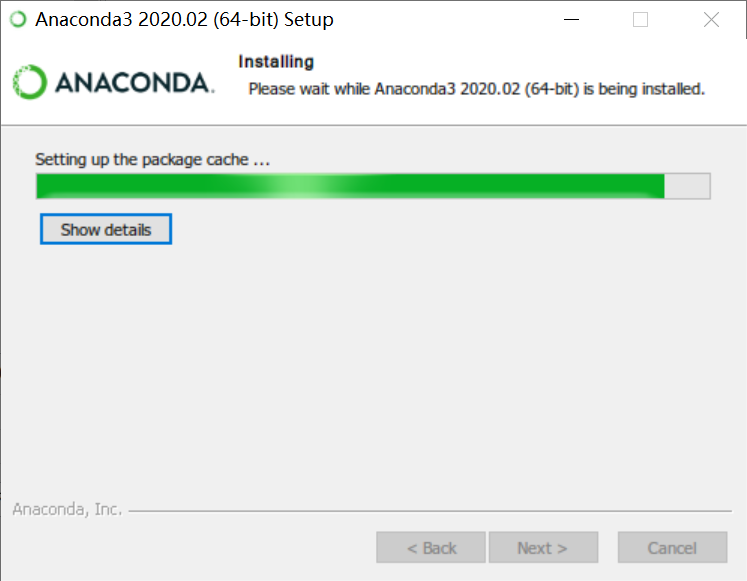
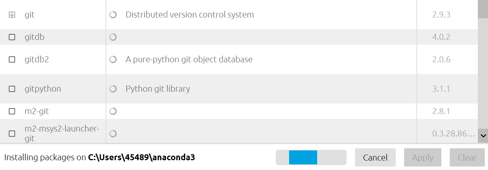

# PYTHON

## Anaconda

在经历过一次意外的 python 文件损坏后，我选择了使用 ANACONDA 来使用 python
安装过程并不复杂！（注意安装路径不能包含空格，所以它默认安装的位置有点特立独行。）

另外，anaconda 中是一个包管理器，意味着它的源中有一些包可以安装（虽然不是说所有“软件”都可以用它安装，一般来说那些需要添加到`PATH`里面的可以在 anaconda 中找找）

例如：自带 pandoc，python，还可以安装 git（之前因为感觉安装 git 让电脑很乱之前不想装，现在可以利用 anaconda 进行管理，一键删除，就很好）

### 如果原本安装了 python

[完美解决 Python 与 anaconda 之间的冲突问题](https://blog.csdn.net/GOODUU/article/details/80846493?utm_medium=distribute.pc_relevant.none-task-blog-baidujs-3)

### 指导网址

[Getting started with Anaconda — Anaconda documentation](https://docs.anaconda.com/anaconda/user-guide/getting-started/)
[Anaconda](https://know.anaconda.com/Distribution-Tutorial-LP.html)
[Anaconda 使用总结_python_learn_tech 的博客 - CSDN 博客](https://blog.csdn.net/learn_tech/article/details/79235420)
[Bioconda软件安装神器：多版本并存、环境复制、环境导出](https://mp.weixin.qq.com/s?__biz=MzI5MTcwNjA4NQ%3D%3D&idx=1&mid=2247489108&scene=21&sn=0d0ec3dc931271a509fed07cb0efcfd7#wechat_redirect)

### 问题

刚开始环境变量并没有添加 anaconda 以及 python，解决方案 [win10+python3 下 Anaconda 的安装及环境变量配置](https://blog.csdn.net/u013211009/article/details/78437098)
anaconda 的源中一些包并没有，比如说 pyperclip 还得用 pip 安装，不过安装后仍然可以被管理。

### 升级

Anaconda Navigator 提示升级点了没反应，网上找到这个方法. 至少命令行有文字显示舒服点.
[Anaconda 如何升级到新版？ - 知乎](https://zhuanlan.zhihu.com/p/121601968)
另外在我安装的时候`conda update anaconda`会一直`solving environment`, 直接`conda update --all`则成功.

如果不升级，一些包是旧版本的，就可能导致更难以兼容，在安装新包时就会一直 solving environment(?)
[一招解决 Conda 安装卡在 solving environment 这一步](https://blog.csdn.net/qazplm12_3/article/details/108924561?spm=1001.2101.3001.4242)
