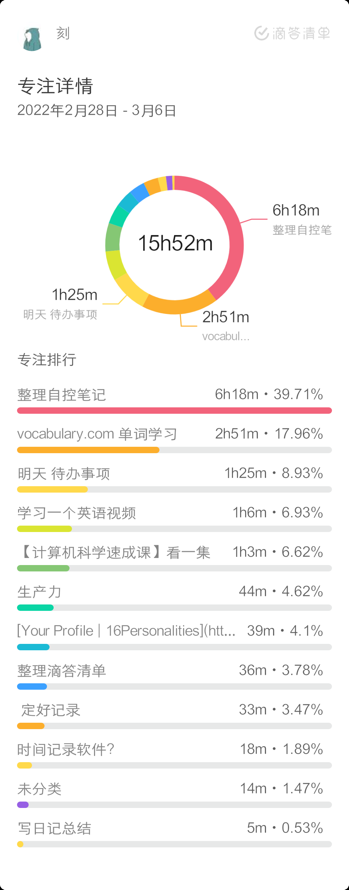
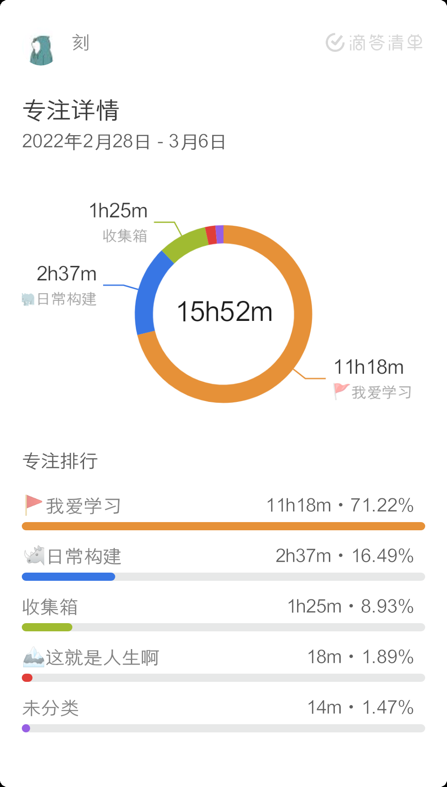
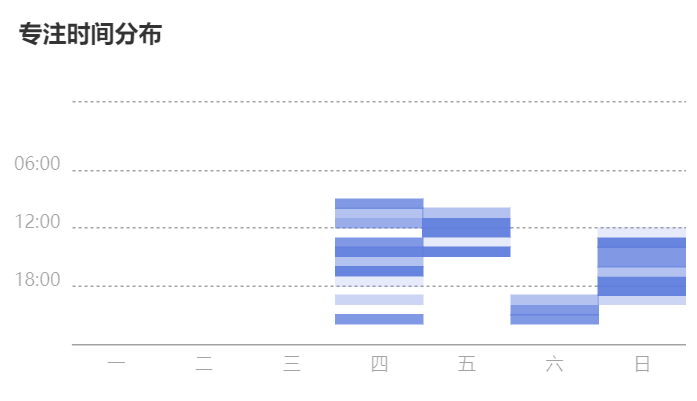

# 用滴答清单规划一切

之前提到软件有两类

- 待办事项清单，擅长管理各种任务以及时间设定
- 事件记录软件，擅长分析时间消耗
然后我发现滴答清单日历视图功能挺完善的，可以在日历上计划时间线，同时可以显示专注记录（虽然好像没有导出数据功能）. 基本可以满足两种需求.
目前觉得可以试一试更偏向于传统的事件记录软件，主要是记录分析自己学习，娱乐等等的状况. 由于 boosted 是"中间派", 过去满足的需求现在可以由滴答清单接手.. 所以可以再找找..

!!! cite
    Boosted 从定位上首先是一个**项目计时工具**，其任务管理不是其核心 Feature，可以做**粗颗粒度** （子项目） 使用。单靠 Boosted 肯定满足不了严格意义的任务管理需求，专业的需求交给专业产品。
    ——from [Play 商店今年的「年度最佳」，不可多得的免费任务管理工具：Boosted - 少数派](https://sspai.com/post/57563)

后续：
~~看了一圈后觉得还是继续用 boosted 吧.. 毕竟有个破解版，能用到全部功能，需求基本都能够被满足.~~
最后用 TimeTrack 这一软件，更少的任务计划，更简单纯粹的时间记录.
[timetrack.io](https://app.atimelogger.com/#/app/reports) 登陆账户可以在线看数据欸！!

不过到今天位置，我发现我对于时间记录也没什么执念了. 我为什么要知道自己吃饭花多久睡觉花多久学习花多久？如果我的生活有一个很紧迫的事情要做，也许我可以记录一下看看哪里效率低，并针对性改进，但是现在我并没有这样的需求.
TimeTrack 的确挺强大的，但是我老是忘，另外我不太清楚我记录这些时间要干嘛，导致我拿不准要切换到哪个分类.
另外，使用滴答清单本身就可以记录我的专注时间，虽然并不是记录了所有时间，但是差不多就是我关心的了.
（我现在关心的无非就是我学了多久/有意义的时间，以及玩了多久/相对没有意义的时间，只有两类，有专注记录和没有专注记录就能区分开）
另外，通过把任务分到不同清单，我也能区分出我花在不同类事件的时间.

日后再看看情况吧~

另外，由于复试待办事项放在 taskade 上面，专注于滴答清单让我有点忘记复试了.. 所以我想也许我需要合并起来，虽然滴答清单并不太擅长处理项目.

??? info "2.28-3.6 记录与分析"
    === "专注时长分布 - 任务"
        
        主要花费时间在于整理笔记，记英语单词
        不过我觉得效率不太高，整理笔记整的很慢...
        记单词使用 vocabulary.com, 没有单词软件记得快
    === "专注时长分布 - 清单"
        
    === "专注时间分布"
        
        专注的特点是一旦开始很容易坚持下去，不过上午没怎么学习过，起床太晚.
    === "timetrack"
        这周记录都不全，没什么参考价值...
    === "boosted 数据"
        因为决定不使用 boosted 了, 所以把 2022.1.1 - 2022.3.6 的[数据](assets/20220306/boosted%2020220101-20220306.csv) 导出来了.

> 通过数据分析之后，要采取一定的措施改进啊~~~ 另外，别执着于原始数据了... 我发现我挺想要专注的原始记录，滴答清单导出不了.. 但是要这没啥用啊，重要的是进步！和快乐！不要折磨自己！
