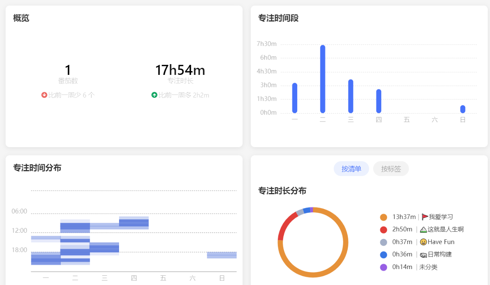
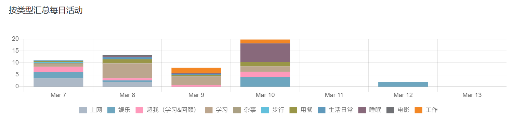
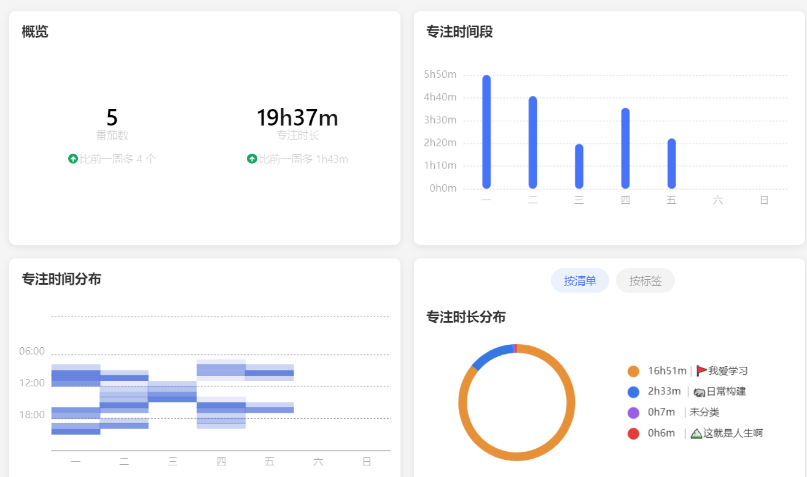
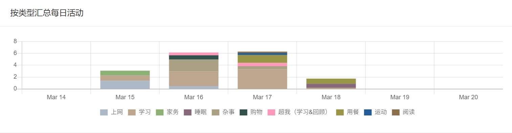
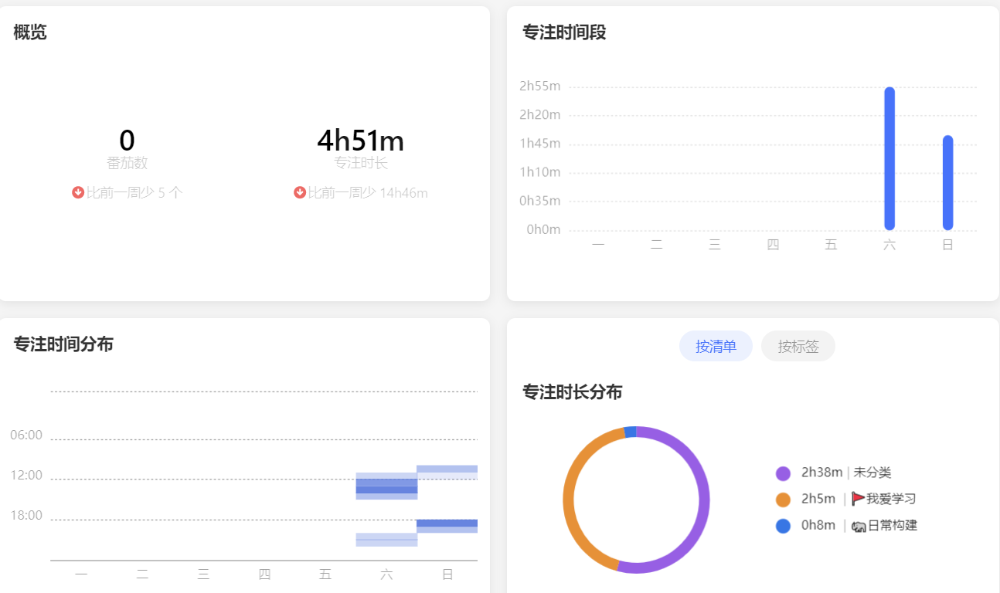
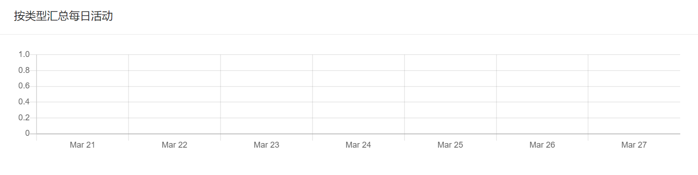

# 日常记录

??? info "3.7-3.13 记录与分析"
    === "滴答清单"
        
    === "timetrack"
        

总的来说，上周状态从越来越好到突然下降，颓废了 4 天+，那几天心理状态还比较一般.
我想可能是 push 自己？
每天只顾着完成任务，但是没怎么思考各个事项的轻重缓急和意义. 我想以后要避免零碎化的一项一项执行，而是分成不同类目（如长期投资，放松，学习任务）等，这样心不会累.

??? info "3.14-3.20 记录与分析"
    === "滴答清单"
        
    === "timetrack"
        

由于开始准备复试的缘故，到后面就没怎么记录，可以看到接着上周打起精神后马上状态又下滑了. 本身学习状态就不太行... 一言难尽啊
我想需要注意的一点是，在没有 DDL, 时间相对宽松的时候，我的日常计划还能执行，但是一旦紧张起来就执行不了了. 这可能意味着我的日常规划实际上是低效的.
需要进行一定的改进。我想首先要对**任务进行精简**，比如说学习英语，每天空出一个单独的时间统一学习（甭管是看视频还是背单词）, 这样效率高，也方便养成习惯.

??? info "3.21-3.27 记录与分析"
    === "滴答清单"
        
    === "timetrack"
        

懂得都懂。.. 复试那一阵子状态挺不好的..
不过最后两天复试结束后重新开始努力 productive 了！
另外今天感悟到一个道理：**让人产生幸福感的不是完成了很多事情带来的成就感，而是规律的生活带来的有意义的感觉**.
体现在任务管理上，就是不要一味地去想我要做什么我要做什么，然后**添加很多细碎的任务**一件一件做得人都麻了，而是要站在更高的角度，想一下我希望的生活是什么样的，这件任务**属于我希望生活中的哪个部分**，然后**尽量通过大块时间段去执行分配**.
