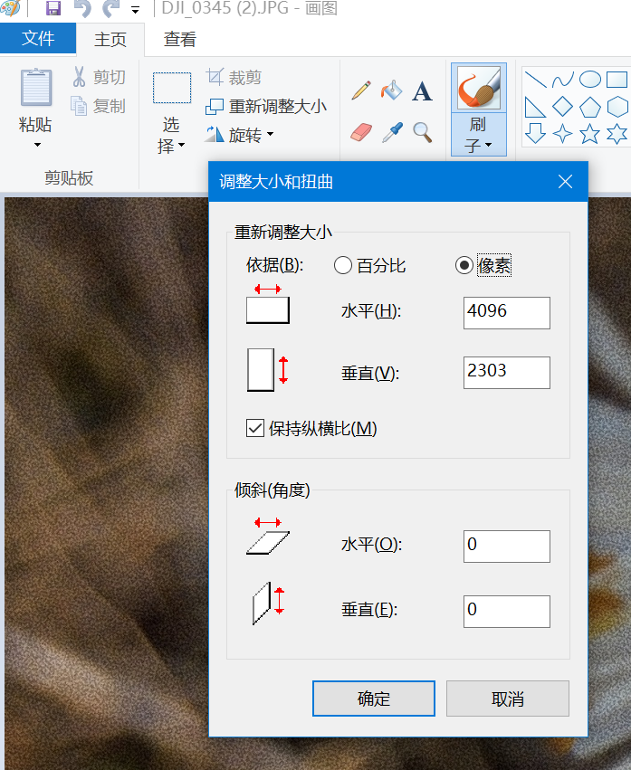

# 图像处理方法

这里所说的图像处理主要是指拍摄得到原始文件后,

## 广义图片处理

发现了这个网站:
[PIXLS.US - Free/Open Source Photography](https://pixls.us/)
在[这个页面](https://pixls.us/software/)上, 介绍了图片处理(的开源软件)大概有:

- Raw Processing: process raw images from digital cameras, 用过 [Filmulator](https://filmulator.org/download/), 大概就是能够把 raw 图片自动帮你调成电影风格的
- Pixel Editing: 很久以前下载过 `Imagemagick`..
- View, Sort, and Manage: 用过 `digiKam`, 可以管理图片
- Camera Utilities
- Color and Profiling
- Web Galleries
- Other

## 关于 RAW 图片处理

如果使用(专业)相机拍照的话, 可能就会得到 RAW 格式的图片 `.DNG`

`2022.2.25` 研究了一下午

- 首先 RAW 格式的图片尽量避免对原始信息进行修改, 保留了更多信息, 因此理论上后期能够发挥的自由度更大, 可能调出更加清晰美观的照片.
- 但是, 对于非专业人士来说并不友好
    - 一般不能直接打开 RAW 图片, 必须采用专业的软件
    - 既便打开了可能也很丑, 因为保存的是原始信息, 没有进行优化.
- 所以需要自己进行后期调色之类的, 如果只是记录生活, 也不需要拍出多么惊艳的画面, 那就大可不必用这种格式保存, 折磨自己了.. 即便你用了一个帮你自动优化 RAW 图片的软件, 而自己并不会再费力进行改动, 那感觉也没什么意义..

结论是: 日常使用, 没有专业要求, 就不需要用这种格式了; 如果是拍摄比较极端的情况, 或者自己有专业处理的需要, 相机本身大概率自动优化不好, 那就可以使用以下, 保存尽可能多的信息.

## 图片压缩

PC 用"画图"打开, 修改像素数目即可.

