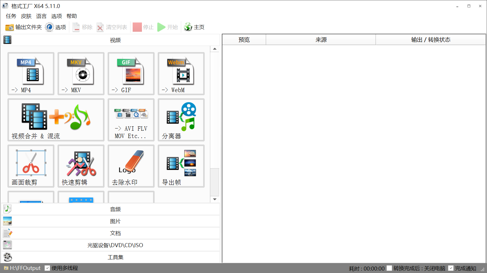

# 视频压缩

!!! note
    起因是硬盘空间不够了, 想把一些视频压缩一下.
    研究了一下发现太麻烦了… 算了吧

**只要进行压制就会有画面损失，压制的目的就是为了用更小的体积来得到更接近原片的画质（码率和画质基本上成正比），所以你调整设置中的参数的关键就在于你觉得哪个更重要？体积？画质（码率）？还是速度？你需要做的是找到一个平衡点，这个点每个人都不可能完全一样，所以需要你自己去找。请不要尝试压制那些低码率的视频，如果你的视频在经过压制之后，体积增大了，那大概率是因为你把低码率的视频压制成了更高码率的视频，这样做显然是没有意义的。**

## 1 格式工厂

[格式工厂真的那么差吗? - 知乎](https://www.zhihu.com/question/383609983)

## 2 小丸工具箱

!!! warning
    使用的时候一直说地址含有非法字符(?), 改不好了, 就没用

[小丸工具箱官方网站](https://maruko.appinn.me/)
官网上的下载地址都是百度网盘, 失效了, 在这里可以下 👇
[@小丸酱 的个人主页 - 微博](https://weibo.com/xiaowan3)
[小丸工具箱（所有版本）视频压缩工具（前两天给删了，重新补。这下没有违规吧） - 『精品软件区』 - 吾爱破解 - LCG - LSG |安卓破解|病毒分析|www.52pojie.cn](https://www.52pojie.cn/thread-1413328-1-1.html)

!!! cite
    分辨率、码率、帧数等等，这些都是视频的参数
    视频在压制过程中还有很多参数的
    那些小组和大神都是自己写参数，小丸这些工具就是把这些参数做到尽可能的平衡和最优
    我曾经用格式工厂和小丸用相同参数压制，效果一眼见高低
    不信你可以自己压了比一下
