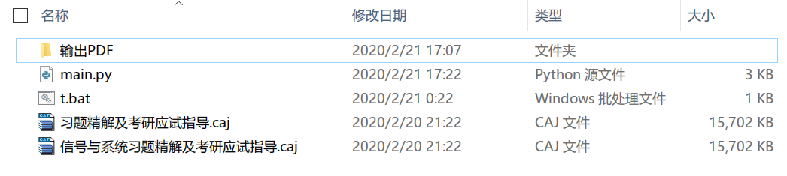
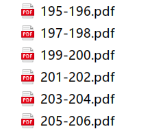
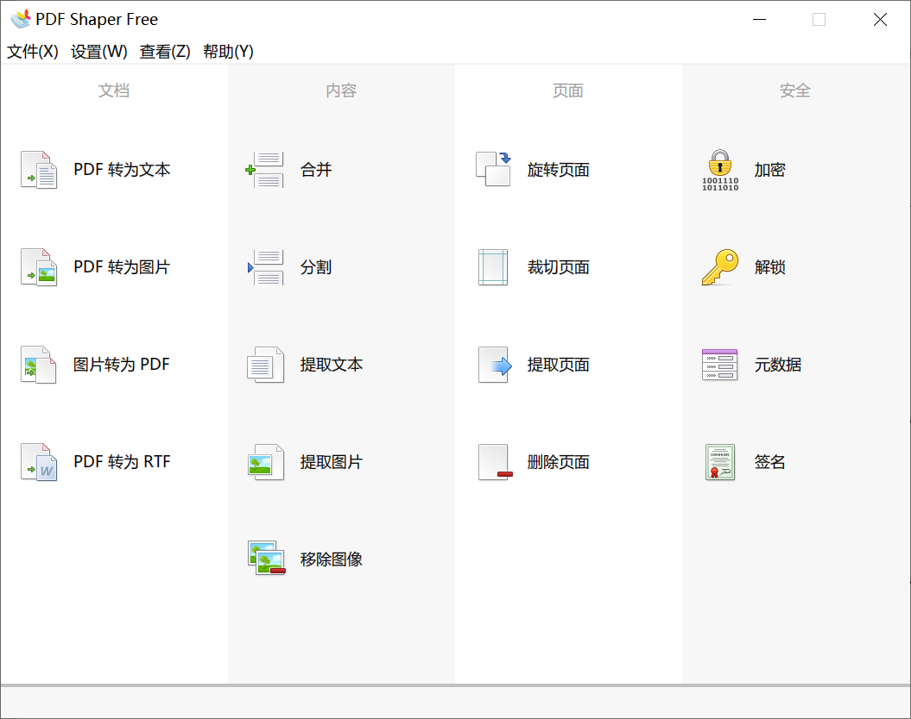
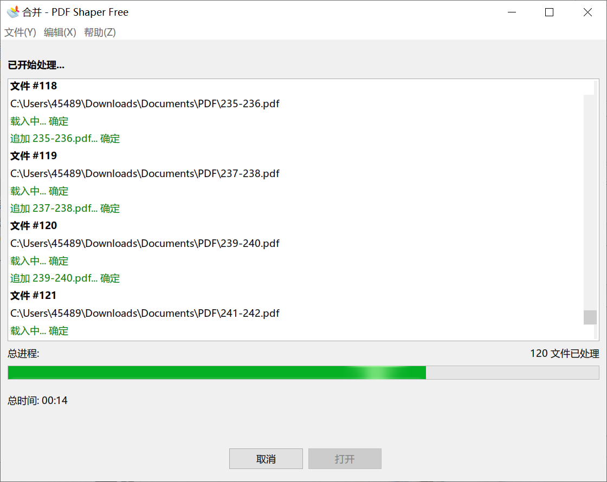

# caj 文件转 PDF

## 背景

在[科学文库](https://book.sciencereading.cn/)下载到一本教材习题解答，可是为 caj 文件，只能使用 CAJViewer 才能联网打开，且15日后又要重新下载。CAJViewer本身具有导出打印功能，可是最多只允许打印两页。

于是乎，在B站找到一个名不见经传的[教程视频](https://www.bilibili.com/video/av89826817?t=247)，并下载到了相关代码。

似乎百度上的迅捷转换有caj转换PDF的功能，但是限制大小2M，且不清楚对于这种限制15天的文件有没有用。

## 大体原理以及改进措施

利用python的pynput库来控制键盘，通过各种快捷键来实现打印功能。

下面是源文件，在此基础上增加了注释：

```python
from pynput.keyboard import Key, Controller
import time

keyboard = Controller()
total = 365 # 总共的页数
number = 1  # 开始的页数（从第一页开始）
time.sleep(5)   # 延时5秒钟，在powershell中打开这个python文件后，要在5秒钟内切换到CAJViewer窗口

# 循环打印
while number < total:
    with keyboard.pressed(Key.ctrl):    # Ctrl+P 是打印快捷键
        keyboard.press('p')
        keyboard.release('p')
    for a in range(3):  # tab 键在打开的打印窗口中切换到输入页码的部分
        keyboard.press(Key.tab)
        keyboard.release(Key.tab)

    # 输入页码
    keyboard.type(str(number))
    keyboard.press(Key.tab)
    keyboard.release(Key.tab)
    keyboard.type(str(number + 1))
    keyboard.press(Key.enter)
    keyboard.release(Key.enter)
    time.sleep(2)   # 这里有一段延时等待保存文件窗口跳出来

    # 输入保存文件名称
    keyboard.type(str(number) + '-' + str(number + 1))
    keyboard.press(Key.enter)
    keyboard.release(Key.enter)

    # 循环条件的number转到下一个
    number = number + 2

    # 这5秒钟是在等待打印完成
    time.sleep(5)

    # 打印完成后重新打开这个文件，alt+f打开菜单，alt+c关闭当前文件，alt+1，打开历史记录中序号为1的文件
    with keyboard.pressed(Key.alt):
        keyboard.press('f')
        keyboard.release('f')
        time.sleep(0.5)
        keyboard.press('c')
        keyboard.release('c')
        time.sleep(0.5)
        keyboard.press('f')
        keyboard.release('f')
        time.sleep(0.5)
        keyboard.press('1')
        keyboard.release('1')
        time.sleep(0.5)
    time.sleep(3)   # 等待文件打开
```

源文件其实有一些问题：

1. 打印时长太短，打印时长与页面复杂程度成正比，尤其是有很多公式的，打印耗时比较长，所以到后来我逐步改成了15秒，20秒到30秒

2. 是一个开环的程序，就像盲人打字，经过观察，往往会因为打印的时候还没打完就进行到下一个关闭文件环节（这时候按键是不被响应的），进而会导致并没有重新打开就会再打印，导致打印失败。还会有一些其他错误，导致PDF文件虽然创立了，可是出错了无法打开。
    应对的方法：
    1. 源文件是反复打开同一个文件，执行打印，改成了反复打开两个文件，执行打印（源caj文件复制成两份就行了），这样做，有时候可能其中一个文件不知为什么没有打开，程序的设计刚好会使另外一个文件进行打印，提高了容错率（偶然的精巧设计！），然后在下一个循环的时候，又可以两个文件都重新打开一次回到正轨。
    2. 在打印完一遍之后，进行检查，把所有没有被打印到的部分以及打印出来但是打不开的部分（反映为文件大小为0）重新打印，这种操作需要把源代码的`while`改成`for`循环，之前`number`依次递增，改成在指定列表中遍历。
    3. 每个按键之后都增加了微小的延时
    4. 原本考虑到可以使用按键精灵来代替工作，但是学习新的软件耗费的时间成本有点大，所以放弃了。

3. 为了方便使用，还进行了两个改进
    1. 建立了`.bat`文件，不用每次都要打开powershell再输入 `python main.py`运行了。
    2. 把文件的打开关闭放在循环开头。

更改后的[代码文件](assets/caj2pdf/main.py)

## 执行步骤

1. 准备好所需的文件

    

2. 打开两个caj文档，这样历史记录里面的1号2号就是他俩

3. `t.bat`里面的内容就是`python main.py`,每次点这个文件开始运行（也可以手动在这个文件夹打开powershell/cmd窗口运行这个命令）

4. 运行过程中随时准备在错误发生时停止，然后修改代码在上次结束的地方开始。😅😅😅

5. 运行完一遍之后检查有哪些页数出错了需要重印，然后用for循环版的再执行几遍

6. 得到完整的文件

    

7. pdf拼接，可以使用“PDF Shaper free”

    界面
    合并

8. 这种打印的方式会把原来的文档变成图片，目录信息也会丢失，所以合并之后可以添加上目录。
