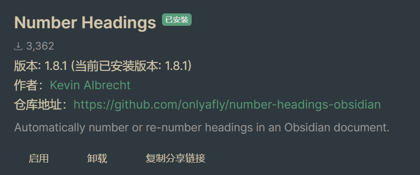
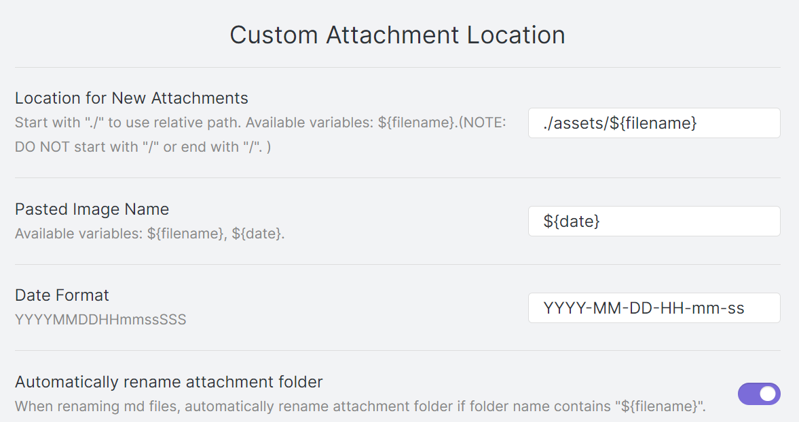
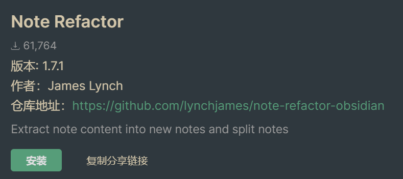
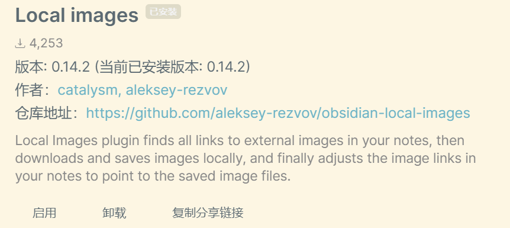
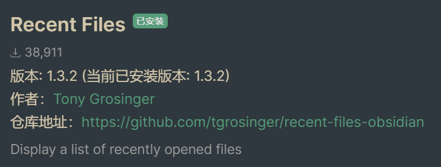
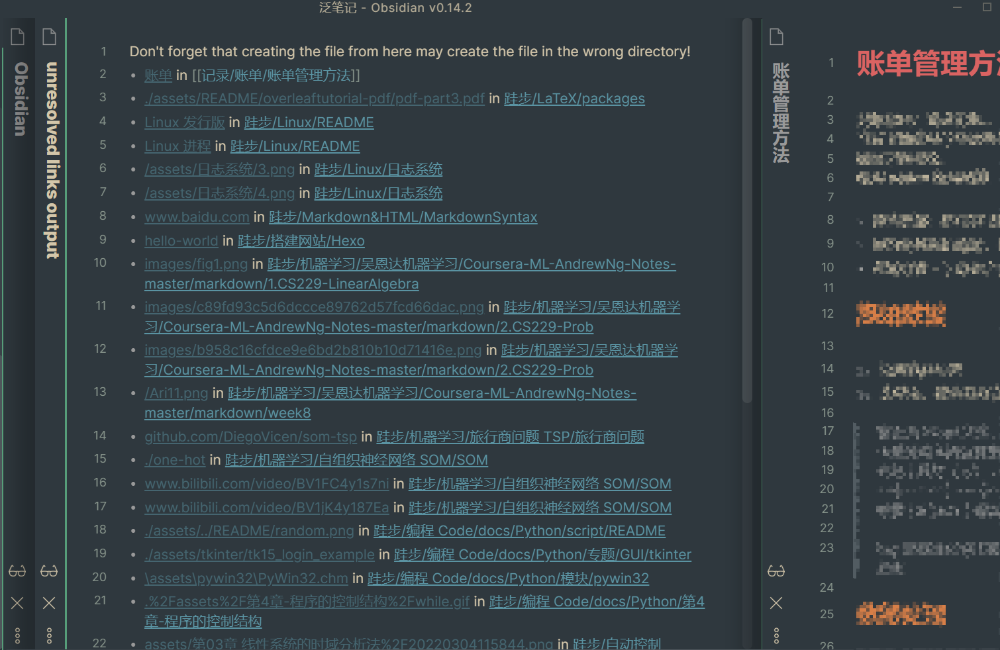
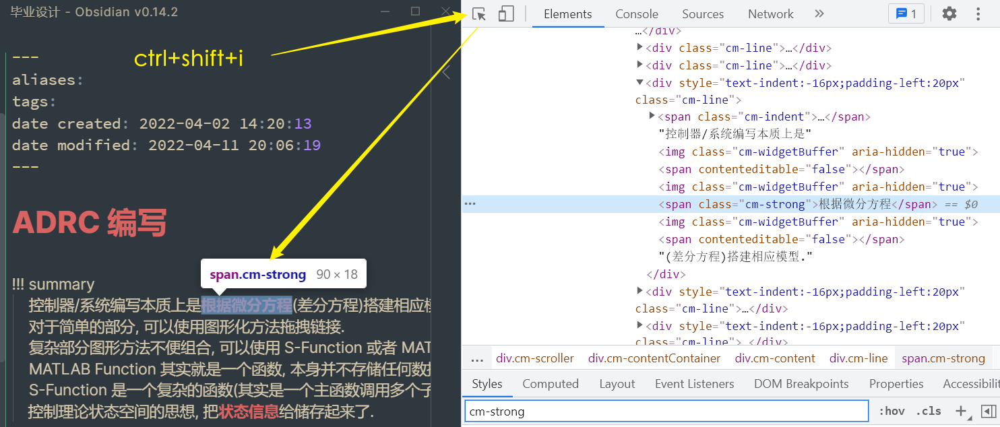

# Obsidian

 [Community - Obsidian](https://obsidian.md/community)

## 1 Why Obsidian

一个简单对比

|obsidian | vscode |
|---|---|
|专注于 markdown 笔记, 有很多**笔记相关**的插件,有**实时阅览**|专注代码编辑,**文本输入更舒适**|
|**速度快**,每个库的插件是独立的|速度慢, 插件全局安装,可以为工作区单独配置|

我觉得当然可以结合着使用… 只能说各有侧重吧. 喜欢 markdown 的我也不想把篮子都放在一个框里,所以从语法层面上不会使用只有 obsidian 支持的语法. (mkdocs 可以生成 html, 所以使用一些也没关系…)
其实**归根结底**好不好用, 还是看有没有好用的**插件**…

## 2 软件配置

Obsidian 的每一个库文件夹下都有 `.obsidian`, 包括所有配置信息以及安装的插件.
每个库都有独立的插件和主题, 所以每新增加一个库就得**重新配置一遍**. 或者干脆把 `.obsidian` 移动到相应的位置, 那么所有的设置,主题,插件都会被复制过去.

Obsidian 本身需要修改的几个关键配置: (根据我的使用习惯)

- 使用制表符 --> off 禁止 Tab 符号
- 拼写检查 English (中文不支持)
- 内部链接类型 --> 插入基于当前笔记的相对路径
- 使用 Wiki 链接 --> off

## 3 插件

> 插件是在 github 上的, 可能得挂加速器.
> 中文备份仓库: [插件.md · 宏沉一笑/obsidian-plugin - Gitee.com](https://gitee.com/whghcyx/obsidian-plugin/blob/master/%E6%8F%92%E4%BB%B6.md)

有一些插件会生成文件, 要使用的话最好配置一下文件位置, 避免把文件夹搞得很乱. 比如日记的文件位置, kanban 的位置

### 3.1 文本格式化

#### 3.1.1 Linter 文本格式化

[obsidian-linter/rules.md at master · platers/obsidian-linter](https://github.com/platers/obsidian-linter/blob/master/docs/rules.md#yaml-timestamp)

- 文本格式化, 例如调整空行之类的
 [obsidian-linter/rules.md at master · platers/obsidian-linter](https://github.com/platers/obsidian-linter/blob/master/docs/rules.md) 参考这个页面**设置自己需要的**就可以了.
- 可以自动添加 Front matter. timestamp 默认的格式是 `dddd, MMMM Do YYYY, h: mm: ss a` 看着不习惯, 可以调整成 `YYYY-MM-DD HH: mm: ss` 就是 `2018-10-28 22:54:43`.
 [Moment.js | Docs](https://momentjs.com/docs/#/displaying/format/)

#### 3.1.2 Pangu 盘古

中英文添加空格.
但是**这个并不会转化中英文标点**. 功能比较弱.

#### 3.1.3 ~~Show Whitespace~~

方便看有几个空格, 这样缩进好调整. 但是**好像不太好用**

> [Show whitespace in editor - Feature requests - Obsidian Forum](https://forum.obsidian.md/t/show-whitespace-in-editor/4237)
> [Show whitespace plugin - Share & showcase - Obsidian Forum](https://forum.obsidian.md/t/show-whitespace-plugin/7729/8)

总之这个问题**没被很好地解决** #todo

#### 3.1.4 Number Headings 标题加序号

自动给标题加序号.



安装好后，需要设置:

- `Skip top Heading Level`
- `Automatic Numbering`

然后就会自动给当前打开的文件的标题进行标号， 默认是 `1.1.2` 这样的格式

#### 3.1.5 ~~Regex Pipeline~~ 正则替换

这个插件可以自定义一些替换规则, 感觉挺有意思的, 但是我没有试.
例如你可以自动进行这样的替换 `![] --> ![alt]`
[Regex Pipeline guideline.md](https://gist.github.com/No3371/f1750b178376f0659df6650ccaf57c12)


### 3.2 文件组织管理

#### 3.2.1 Custom Attachment Location 管理图片位置

 [RainCat1998/obsidian-custom-attachment-location: Customize attachment location with variables($filename, $data, etc) like typora.](https://github.com/RainCat1998/obsidian-custom-attachment-location)
> 使用这个插件是因为我的习惯(一直用 vscode 的配置)是把图片放到 `assets/${filename}` 文件夹下

- 它可以自定义路径, 图片名, 甚至更改文件名可以自动更新链接!
- 有空格会自动加 `%20`

参考配置


> 不知道是不是这个插件的作用(没有测试),我移动 `file.md` 的位置, 存图片的`assets/file/`也同步移动了! 挺不错的.

#### 3.2.2 Note Refactor 切分文件

通过标题拆分文件.
在新写一篇笔记时，出于方便我都把所有内容写在一篇笔记里，如果写到后面发现内容太多，想拆分为多篇笔记时，这时笔记内容已经很庞大，手动将一段段内容剪切出去非常麻烦，这时可以通过 Note Refactor 一键将一篇笔记通过标题进行拆分。



#### 3.2.3 Obsidian Git 版本控制

可以定期使用 git备份, 当然更精细的备份可以使用 vscode 之类的, 这个我觉得适用于定期5min备份一次, 防止误操作.
没有深入研究.

#### 3.2.4 3.2.4 Local Images 图片链接下载到本地



好像图片下载位置设定不够灵活, 不过也能用.

## 4 编辑器界面

### 4.1 Recent Files 显示最近编辑文件



## 5 其他

`obsidian-checklist-plugin` -  清单检查

[liamcain/obsidian-calendar-plugin: Simple calendar widget for Obsidian.](https://github.com/liamcain/obsidian-calendar-plugin)

[OfficerHalf/obsidian-collapse-all](https://github.com/OfficerHalf/obsidian-collapse-all)

kanban 可以用来规划之类的…

[deathau/sliding-panes-obsidian: Andy Matuschak Mode as a plugin](https://github.com/deathau/sliding-panes-obsidian)
最后效果大概是这样子的, 从左到右一层层点开链接, 很方便. (发现似乎得**按住ctrl点链接**). 下面有滚动条.


[Vinzent03/find-unlinked-files: Find files, which are nowhere linked, so they are maybe lost in your vault.](https://github.com/Vinzent03/find-unlinked-files)
这个插件(对于我)主要是用来找到那些**失效的链接**. 可能是由于不规范, 或者文件已经被移动到别的位置了.

# 5 自定义 CSS

简单元素的修改: `ctrl+shift+I` 调出开发者工具, 之后选中自己想修改的元素, 找到其类名. 然后自己添加 css 代码.


例如上面确定粗体对应的类是 `.cm-strong`, 在`外观-css代码片段` 部分添加如下样式, 粗体颜色就被改变了.

```css
.cm-strong
{
    color: #da6362
}
```

1. 修改文本, **预览样式同步修改**
2. 阅读视图, 实时阅览的样式是分开的…

# 6 Tips & Furthermore

我觉得 Obsidian 的链接有点搞不懂… 有时候链接找不到你一点会自动帮你创建对应的文件.
另外缩进也不容易看清楚.
所以建议用 Obsidian 进行笔记的书写, vscode + git 确保没有出错.
