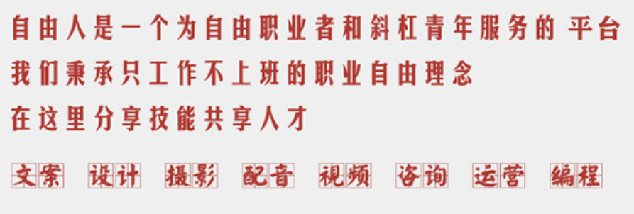

# 关于搞钱

[暑假搞钱！5个渠道，月入上千【空卡】_哔哩哔哩_bilibili](https://www.bilibili.com/video/BV1QZ4y1v75Y?spm_id_from=444.41.list.card_archive.click&vd_source=abac80284e79fbbb35a2429361f8ba89)

## 1 自由职业

---

[自由人协作平台](http://www.freemancn.com/index.php?do=index)

- 远程工作平台，各种需求信息发布后申请
- 网站有点简陋，比如有的按钮点不开…… [如何评价自由人远程工作平台？ - 自由人协作平台的回答 - 知乎](https://www.zhihu.com/question/52945363/answer/623376087)
- ⭐⭐

---
[在线雇佣威客&寻找自由职业工作 | Freelancer](https://www.freelancer.hk/)

- 注册的时候会有很多分类，选择自己会的
- [Freelancer注册操作教程及收款方式分析 - 知乎](https://zhuanlan.zhihu.com/p/137472953)
- 绑定银行卡这个… 有点麻烦, 最后没搞
- ⭐⭐⭐

---
<https://www.upwork.com/>

[Upwork 小白初体验 - 知乎](https://zhuanlan.zhihu.com/p/355820833)

## 2 翻译

> 研究了一下发现, 做翻译的人真的不缺, 不要指望着用这个赚钱… 可以锻炼锻炼英语能力

[拯救翻译的CAT工具，你最爱用哪个？ - 知乎](https://zhuanlan.zhihu.com/p/31555085)

---

[译言古登堡计划](http://g.yeeyan.com/)
译言网, 注册门槛比较低. 申请制翻译, 感觉收入会比较少, 更多的是纯兴趣+积累经验.
> **选择感兴趣的图书项目，进入项目页面报名。报名译者需参加试译；报名项目负责人需提供详细简历，有相关经验优先。**

> 对于公共版权图书，译者享有译作的著作权和署名权，通过收入分成（电子出版）和版税（纸质出版）获得稿酬。上市后，电子书按季度结算，纸质书按180天（首印）和年度（加印）结算。
>
> 对于知识共享协议图书和特殊版权图书遵循相应授权方式，译者享有署名权，译者一般为志愿翻译，最终的电子版图书将免费传播。

---
[专业翻译公司_多年本地化经验_英语翻译-我译网](https://www.wiitrans.com/)
TODO: 待注册, 试译

---
Gengo
注册时有一个翻译测试, 挺难通过的.

---
[做到！- 阿里翻译众包平台](https://www.zuodao.com/crowdsourcing/homePage.html)
