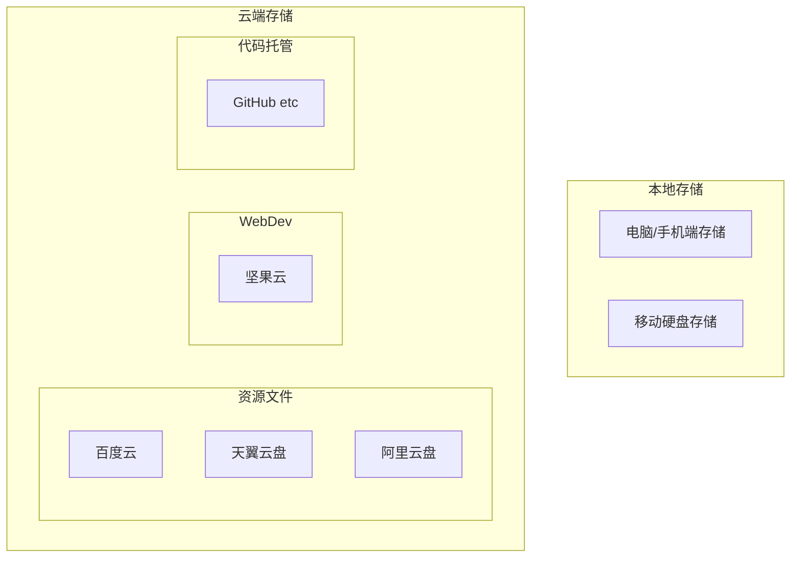

---
aliases:
tags: []
date created: 2020-03-21 12:22:46
date modified: 2022-04-18 15:03:09
---

# 文件同步存储方案

> 只是表述**最后一次更新时**的文件同步方案，历史版本也许可以从 git 里看看.

主要目的:

- 备份文件,防止文件丢失 ;
- 多平台同步(需求不大,就一个电脑 233), 一些资源文件希望可以跨平台使用(如音乐文件).

## 1 同步方案概述

本地硬盘之间同步使用软件 [FreeFileSynk](https://www.iplaysoft.com/freefilesync.html)

- 对于一些重要的资料，除了**本地存储**以外，还通过**云端存储备份**
- 一些本地存不下的资料（或者本身就来自于网络，没有完全下载下来的）, 存在**网盘**里面.

还有一些细节见下面补充

## 2 文件存放位置

电脑端/手机端产生的原始文件，在整理之后放到下述相关文件夹。

- 本地存储
  - 电脑/手机端存储：作为大部分数据产生的**来源**，不作为稳定/可靠的存储位置
  - 移动硬盘存储：存一些不经常查看的，或者备份/归档重要文件
- 云端存储
  - 资源文件存储
    - 天翼云盘：当做**云端同步盘**（功能没有坚果云强）, 用于多端查看频繁修改更新的内容
    - 阿里云盘：空间大，不限速，可以用来备份长时间不用的且不会修改文件夹结构的
    - 百度云：分享
  - 坚果云
    - WebDev 功能用来同步一些特别的东西
    - 有流量限制，所以现在不用来存东西了, 而是仅使用 WebDev 功能辅助其他应用进行数据备份和同步.
  - 代码托管
    - GitHub (Gitee 等国内平台) : 存代码，托管网站

!!! note "其他备用"
    曲奇云盘，内存大，但是网页版好像有点简陋 `2021`, 未来在看看吧.
    teambition

## 3 特别说明

` 学习使我快乐 `  存的是大学的所有资料(上课笔记, 考研资料, 成绩等), 移动硬盘+天翼云盘备份
` 泛笔记 ` 存的是我的**实质知识体系**, 移动硬盘+天翼云盘同步 (之前用坚果云, 因为有流量限制不用了)
对于个人**知识体系**中一些**主题明确**的独立笔记内容, 目前在尝试托管到 github 上

- 对笔记本体进行托管, 可以追踪笔记更新内容
- 对笔记生成的网站进行托管, 添加到 个人网页 这种, 方便分享.

### 3.1 天翼云盘使用补充

- 文件以及文件夹名不能有特殊符号(emoji) , 不然不会被同步
- 不会同步隐藏文件夹!
- 只能创建一个同步文件夹, 所以 windows 创建 Junction 类型的**软连接**可以把其他地方的文件夹放到同步文件夹下. 实现统一同步.

## 4 其他

为了更好地保存文件，还需要拥有文件整理的工具，例如批量重命名，检测新增文件并重命名移动的工具。

## 5 Furthermore

 [FreeFileSynk](https://www.iplaysoft.com/freefilesync.html) 用起来很方便, 可以根据文件的修改时间判断如何同步. 但只针对本地硬盘.
 云盘的备份, 似乎只能简单地上传下载, 并不能有很好的同步功能 (除了同步盘以外)…
 所以有机会可以研究一下.
