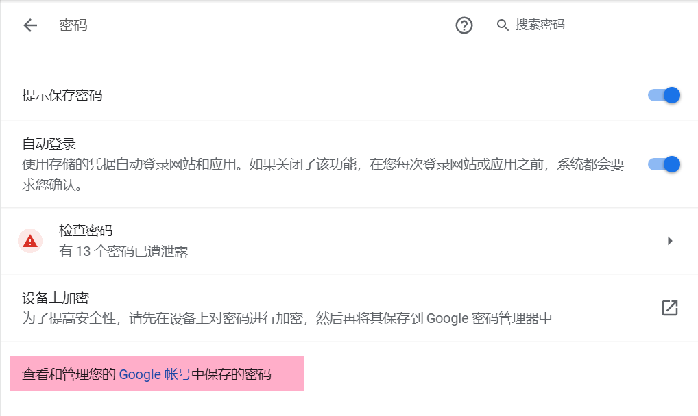

# 浏览器一致性

在某些情况下, 我们可能会同时使用多个浏览器, 并且希望不同浏览器之间的体验比较一致.

## 1 浏览器书签一致性

使用 **floccus 插件**进行书签同步, 基本上需要坚果云的 WEBDEV 功能

同步有三种模式, 我觉得比较靠谱的是主要使用的浏览器使用向上同步覆盖云端, 其他浏览器使用向下同步, 这样不会出现冲突.
不太确定这个软件会不会判断书签添加/修改的时间进而合并修改, 再加上只有浏览器被运行时插件才会进行同步, 所以觉得第三个选项可能会有风险, 没有用过.

??? warning "配置信息"
    

## 2 新标签页一致性

使用 **Infinity 新标签页** 插件, 通过 **QQ 登录账户**, 就能同步新标签页设定.

!!! note "关于日常访问"
    一般新标签页插件都可以添加网页图标, 方便快速访问. **但是**, 考虑到新标签页添加"书签"和浏览器本身的书签功能基本一致, 目前(`2022.06.28`)选择让新标签页空白, 只保留搜索栏, 这样看起来简洁.
    通过书签栏主动收藏的"日常访问"和"在顶部显示常用网站"选项方便日常访问网页快速访问.
    

## 3 密码自动补全一致性

谷歌浏览器自动补全功能 有一个 "密码管理器", 可以导入导出密码.

> cookie 没有研究过, 但是查了下确实有方法. [浏览器导入和导出cookie](https://blog.csdn.net/m0_46374969/article/details/121361104)

其实我觉得更安心的操作是**使用自己的Excel密码本**, 要登录账号去查密码本. 方便修改, 补充网站信息. 还有同一网站不同账号.

## 4 其他常用 Chrome 插件

### 4.1 使用习惯

> 不一定是用这些插件, 相同功能的就行

- TabCopy --> 快速复制 markdown (或其他) 格式的网址链接
- OneTab Plus / 搁置的标签页 --> 一键收起所有标签, 下次再处理
- SimpRead --> 网页阅读, 笔记归档
- 沙拉查词 --> 英语划词, 学习(与anki联动之类的)
- 谷歌上网助手 Ghelper --> dddd
- AD Guard 广告拦截器
- 油猴子插件 (如果有用到基于它的一些插件的话)
    - 之前用过 **HTML5 视频播放器增强脚本**, 挺强大的, 有很多快捷键(和plotplayer大概是一样的)
    - 空格之王 自动为中英文之间添加空格

### 4.2 RSS

- Inoreader
- RSSHuB Radar

## 5 特殊案例: Edge & Chrome 浏览器一致性

`2022.7.28` 发现 Edge 浏览器有一个功能, 就是在设置的 `个人资料/导入浏览器数据` 里, 可以导入其他浏览器的数据.

> 它应该不能做到完全复刻, 比如插件的配置信息.

可以选择每次打开 Edge 时, 自动从 Chrome 浏览器导入最新的收藏夹, 历史记录, 插件等.
这样(大概)就不需要上面说的一些繁琐的设定.

**对于平时主用Chrome浏览器,偶尔使用Edge浏览器的我来说, 是很好的**
